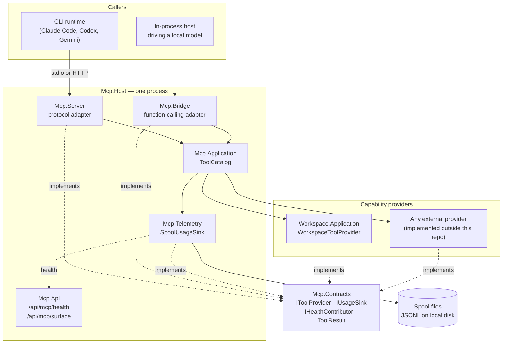
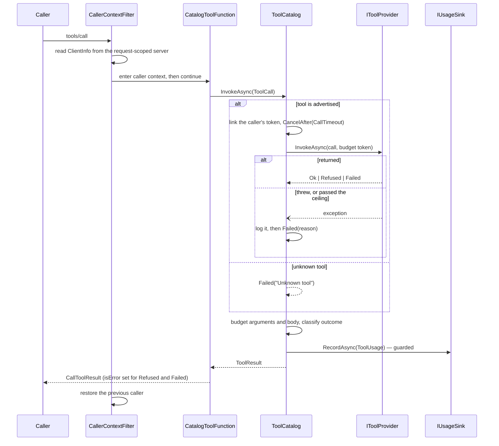

# Architecture — dew_flow_mcp

> The system **as it is**, 2026-08-16. Everything below is in the repository today; what is planned but
> absent is listed in [What does not exist yet](#what-does-not-exist-yet) rather than described as if it
> did. Open work lives in [../todo/](../todo/).

## What this is

A **Model Context Protocol tool server**, and the framework a tool set plugs into. It hosts tools,
publishes them on two surfaces, and meters every call — and it knows nothing about where the tools come
from.

The one architectural commitment everything else follows from: **this repository is public, and it must
not know that retrieval exists.** `IToolProvider` is declared here and implemented outside, so the
dependency arrow points **inward only** (RAG → MCP, never back). A test fails the build if any shipped
assembly here references a `Rag*`, `Editing*` or `Platform*` type, and the private product repository
asserts the same rule from its side.

- **Style** — ports and adapters, with a single dispatch point. Presentations are adapters over one
  catalog; capability providers are adapters under one contract.
- **Stack** — .NET 10, C# latest, `TreatWarningsAsErrors`. `ModelContextProtocol` 2.2.0 for the protocol,
  Serilog for logging, xUnit v3 on Microsoft Testing Platform for tests. Central package management.
- **Transports** — stdio and HTTP, over the same catalog.

## Projects

| Project | Kind | Role |
|---|---|---|
| `Mcp.Contracts` | class library, **zero package references** | The whole contract: `IToolProvider`, `ToolSchema`, `ToolCall`/`ToolResult`, `IUsageSink`/`ToolUsage`, `IHealthContributor`/`ComponentHealth`, `CallerIdentity`, `Captured`, `PayloadBudget`, `SurfaceFingerprint` |
| `Mcp.Application` | class library | `ToolCatalog` — the one dispatch point; `AmbientCallerContext`; the configurable surface (`ToolSurfaceOptions`, `ToolDescriptionCatalog`, `ToolSurfaceProvider`) and its echo (`SurfaceFingerprintReader`) |
| `Mcp.Server` | class library | The MCP protocol presentation: `CatalogToolFunction`, `CatalogToolRegistration`, `CallerContextFilter` |
| `Mcp.Bridge` | class library | The in-process presentation for OpenAI-style function calling: `LocalLlmToolBridge` |
| `Mcp.Telemetry` | class library, **contracts only** | `SpoolUsageSink` — one JSON line per call, on local disk |
| `Mcp.Api` | class library (minimal API) | Management surface: `GET /api/mcp/health`, computed from the registered `IHealthContributor`s; `GET /api/mcp/surface`, the tool-surface echo |
| `Mcp.Ui` | Razor class library | Console pages. Scaffold only — `_Imports.razor` and the csproj |
| `Mcp.Host` | web exe | The standalone server: clone, run, and a CLI has workspace tools |
| `Workspace.Application` | class library | `ISandboxedFileReader` port; `WorkspaceToolProvider` — the one real tool |
| `Workspace.Infrastructure` | class library | `SandboxedFileReader` adapter (streaming, capped); `SandboxedFileReaderOptions`; DI registration |
| `ServiceDefaults` | class library | Serilog wiring, the ANSI console sink, the UTC enricher |
| `tests/Mcp.Tests` | xUnit v3 exe | 105 tests, including the layering guard |

## Containers and dependencies

The dashed edges are the point: every box depends on `Mcp.Contracts`, and `Mcp.Contracts` depends on
nothing at all.

## One tool call, end to end

## Cross-cutting concerns

### Dispatch is a single choke point

Every presentation reaches tools through `ToolCatalog.InvokeAsync` and nowhere else. Two duplicate tool
names stop the host at construction, naming both providers. `SurfaceParityTests` fails the build if
either presentation grows tool logic of its own, or if the two advertise different names or
byte-different schemas.

Because it is the one chokepoint, it is also where the server's own limits live, and every present and
future provider inherits them without knowing: a **per-call ceiling** (`ToolCatalogOptions.CallTimeout`,
2 minutes by default, configurable per host) on a token linked to the caller's, and a **guard** that
turns anything thrown into a logged, metered `ToolResult.Failed`. Neither belongs in a provider, and a
copy of either in a second dispatch path is the drift this repository is shaped to prevent.

### The tool surface is configuration, and the server echoes what it serves

Which tools a process advertises, and what it says they do, are chosen at process start
(`--tools`, `--descriptions`, `--description-set`) rather than compiled in. The reason is measured, not
aesthetic: rewriting **one** instruction about which tool to use when moved a score **16.5 points of
63**, while swapping the toolbox from 4 tools to 18 moved it **1** — so a description is a measured
artefact, and a wording that can only change by rebuilding is one nobody runs ten variants of.

It is applied by a decorator (`ToolSurfaceProvider`) **ahead of** `ToolCatalog`, which is why the
chokepoint above is untouched and the parity guarantee holds by construction: both presentations still
project the one `Advertised` list, and that list is simply now configurable. A configuration that does
not fit — a subset naming a tool nobody offers, a description file for a tool this surface excludes —
stops the host at startup naming both sides.

And a running server can be asked what it is actually advertising: `--print-surface` writes a
`SurfaceFingerprint` to stdout and exits, `GET /api/mcp/surface` serves the same record. This is
*declare and echo, never assume* — what a configuration asked for and what a process is serving are two
different facts, and only the second explains a result. The hashes are computed server-side and quoted;
a consumer compares the string it was given rather than re-deriving it.

### Nothing unattended fails silently

The mission is 24/7 operation, so the rules from
[`.claude/rules/shared/common/reliability.md`](../.claude/rules/shared/common/reliability.md) are
structural here: every wait has a ceiling (above), a detached task ends in a catch-all that LOGS (the
spool writer), client numbers are range-checked before arithmetic (the read window), and `/health`
computes from live state so a component that died at 03:00 is visible to whatever polls at 03:05.

**Everything that grows has an owner**, and on this surface the thing that grows per call is the answer.
A file read is STREAMED and bounded by two caps — lines and bytes
(`SandboxedFileReaderOptions`) — so neither the memory this process holds nor the block it puts on the
wire scales with what happens to be sitting in the workspace. The cap is only half of it: a capped
answer SAYS it was capped, carries the file's true total, and names the `startLine` to continue from,
because a truncation the caller cannot see is worse than no cap at all — the caller reads the end of a
clipped window as the end of the file and stops paging.

### Outcomes are three-state

`ToolResult` is `Ok | Refused | Failed`. A **refusal** is a tool that understood and declined — a path
outside the sandbox, a missing argument; a **failure** is a tool that tried and could not. On the wire
both set `isError`, because the protocol has one error state and this server does not invent a second;
the distinction is kept for telemetry and in-process consumers. Expected failures are values throughout —
only genuinely unexpected infrastructure faults throw.

### "Not captured" is a state, never a default

`Captured` (text) and `CapturedCount` (numbers) carry a flag, a value and a **reason**. The field this
exists for is the caller's model: no MCP revision tells a server which model drives a session, so it
records as not captured with that as the reason rather than being inferred from the client name.

### Caller identity

A call-tool filter reads the request-scoped server's `ClientInfo` and establishes an
`AmbientCallerContext` (`AsyncLocal`) for the duration of the call, restoring the previous one on exit.
The transport name is passed in by the host, which is the only party that knows it. The in-process
bridge declares its own identity, including the model when the host names one.

### Telemetry

Off by default. A host that names a spool directory replaces `NullUsageSink` with `SpoolUsageSink`,
which writes one `telemetry/v0` JSON line per call. It may never block, delay or fail a tool call: a
bounded channel feeds a background writer, a full channel drops and **counts**, and a disk that stops
accepting writes trips a breaker with one log line — as does anything else the writer meets, since the
loop nobody awaits until shutdown ends in a catch-all. The same instance answers the health probe, so a
stopped spool is visible from outside the process. Details:
[telemetry_v0_wire.md](telemetry_v0_wire.md).

Since 2026-08-16 a line can also carry a `correlation` — the leg and phase the CALLER declared with
`--correlation`, added additively within `telemetry/v0` because the consumer was already built to read
an absent object as unattributed. It is never inferred: this server has no idea what a harness leg is,
and every real session declares nothing and reads as unattributed, which is the truth. The flag is
**refused on the HTTP transport**, where one value across concurrent callers would invent an
attribution.

### Logging

One `AddDewFlowLogging` in `ServiceDefaults`, called before `Build()`. Coloured to the console through a
hand-written ANSI sink (Serilog's own console theme emits no escapes once stdout is redirected, which is
exactly what an orchestrator does), and to one file per run under `logs/{yyyy-MM-dd}/`. UTC throughout,
via `UtcTimestampEnricher` — the file is named in UTC, and its lines must not be in local time.
**A stdio host sends its console sink to stderr**, because stdout carries the JSON-RPC.

### Error handling

Tool failures are values. Malformed JSON from a model is a tool failure it can read and retry, never an
exception that ends the loop. Path escapes are refusals with a reason. The guards that throw do it at
**construction**, deliberately — a duplicate tool name and a ceiling that cannot be applied both stop the
host at startup rather than lying about what runs, or throwing once per call for the life of a process
nobody is watching.

`try`/`catch` sits on three boundaries and nowhere else: per dispatched call (the catalog), around the
whole unit including its setup (metering, budgeting included), and as a catch-**all** at every detached
edge (the spool writer's drain loop). Everywhere else, an unexpected exception is left to fly to one of
those three.

### Authentication

**None.** The HTTP transport is open — fine on localhost, and named as open work in
[../todo/PLAN_mcp_product.md](../todo/PLAN_mcp_product.md).

### CI

`.github/workflows/ci.yml` builds the solution in Release and runs the test executable. Tests are run as
an executable, never through `dotnet test` (xUnit v3 on Microsoft Testing Platform has no VSTest host).

## Modules

| Document | Covers |
|---|---|
| [module_tool_dispatch.md](module_tool_dispatch.md) | The contract and the catalog — how a call is resolved, metered and answered |
| [module_presentations.md](module_presentations.md) | The two surfaces over one catalog, and caller identity |
| [module_workspace_tools.md](module_workspace_tools.md) | The one real tool and its sandbox |
| [module_telemetry.md](module_telemetry.md) | Per-call recording and the spool |
| [module_hosting.md](module_hosting.md) | The host, the management API, logging |

## What does not exist yet

Stated because a knowledge base that only describes what is there reads like a claim about what is not:

- **The `rag_` and `graf_` tool families.** One real tool exists (`rt_read_local_file`), deliberately —
  the tool set was always going to change completely.
- **Authentication** on the HTTP transport.
- **`Mcp.Ui`** has no pages: `_Imports.razor` and a csproj.
- **Tokens** are never counted; `ToolUsage.Tokens` is always *not captured* on this surface.
- **A LICENSE, THIRD-PARTY-NOTICES and a version policy** — required before the repository is advertised.
- **Explicit HTTP timeouts and a retention owner for `logs/` and the spool** —
  [../todo/PLAN_reliability_tail.md](../todo/PLAN_reliability_tail.md), items 4 and 5.
- **A bound on a provider that ignores its cancellation token.** The catalog cancels and answers the
  caller at the ceiling; work that never observes the token keeps running behind that answer.
