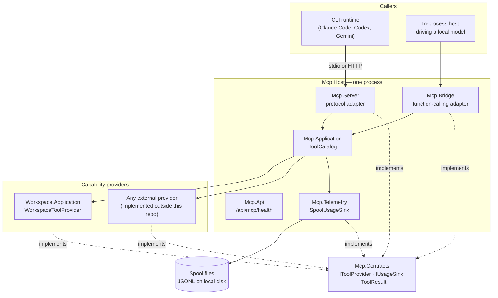
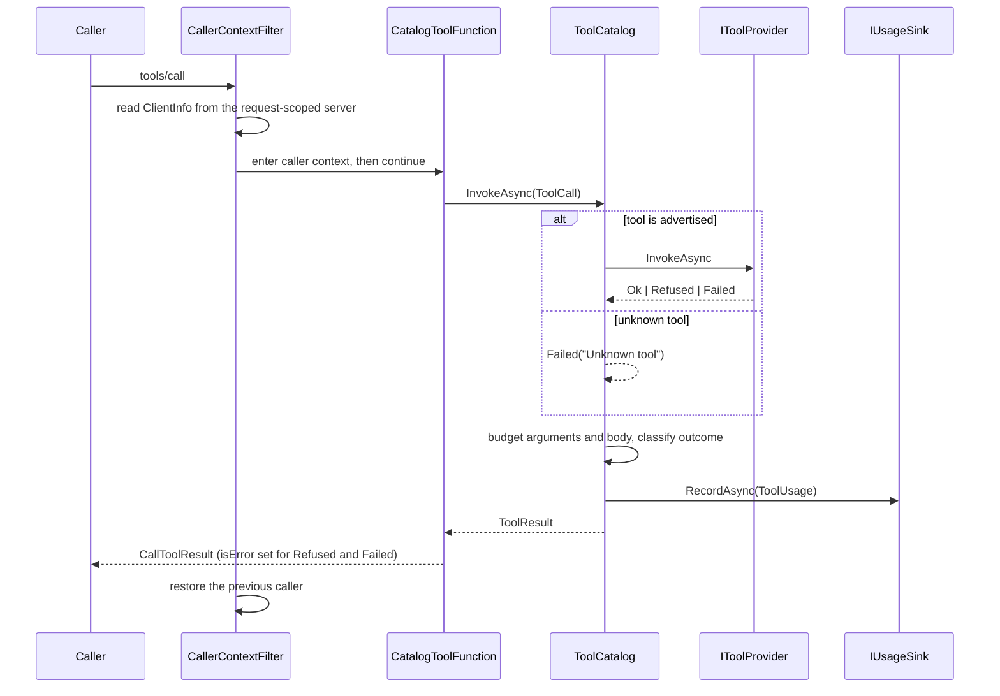

# Architecture — dew_flow_mcp

> The system **as it is**, 2026-08-15. Everything below is in the repository today; what is planned but
> absent is listed in [What does not exist yet](#what-does-not-exist-yet) rather than described as if it
> did. Open work lives in [../todo/](../todo/).

## What this is

A **Model Context Protocol tool server**, and the framework a tool set plugs into. It hosts tools,
publishes them on two surfaces, and meters every call — and it knows nothing about where the tools come
from.

The one architectural commitment everything else follows from: **this repository is public, and it must
not know that retrieval exists.** `IToolProvider` is declared here and implemented outside, so the
dependency arrow points **inward only** (RAG → MCP, never back). A test fails the build if any shipped
assembly here references a `Rag*`, `Editing*` or `Platform*` type, and the private product repository
asserts the same rule from its side.

- **Style** — ports and adapters, with a single dispatch point. Presentations are adapters over one
  catalog; capability providers are adapters under one contract.
- **Stack** — .NET 10, C# latest, `TreatWarningsAsErrors`. `ModelContextProtocol` 2.2.0 for the protocol,
  Serilog for logging, xUnit v3 on Microsoft Testing Platform for tests. Central package management.
- **Transports** — stdio and HTTP, over the same catalog.

## Projects

| Project | Kind | Role |
|---|---|---|
| `Mcp.Contracts` | class library, **zero package references** | The whole contract: `IToolProvider`, `ToolSchema`, `ToolCall`/`ToolResult`, `IUsageSink`/`ToolUsage`, `CallerIdentity`, `Captured` |
| `Mcp.Application` | class library | `ToolCatalog` — the one dispatch point; `PayloadBudget`; `AmbientCallerContext` |
| `Mcp.Server` | class library | The MCP protocol presentation: `CatalogToolFunction`, `CatalogToolRegistration`, `CallerContextFilter` |
| `Mcp.Bridge` | class library | The in-process presentation for OpenAI-style function calling: `LocalLlmToolBridge` |
| `Mcp.Telemetry` | class library, **contracts only** | `SpoolUsageSink` — one JSON line per call, on local disk |
| `Mcp.Api` | class library (minimal API) | Management surface: `GET /api/mcp/health` |
| `Mcp.Ui` | Razor class library | Console pages. Scaffold only — `_Imports.razor` and the csproj |
| `Mcp.Host` | web exe | The standalone server: clone, run, and a CLI has workspace tools |
| `Workspace.Application` | class library | `ISandboxedFileReader` port; `WorkspaceToolProvider` — the one real tool |
| `Workspace.Infrastructure` | class library | `SandboxedFileReader` adapter; DI registration |
| `ServiceDefaults` | class library | Serilog wiring, the ANSI console sink, the UTC enricher |
| `tests/Mcp.Tests` | xUnit v3 exe | 54 tests, including the layering guard |

## Containers and dependencies

The dashed edges are the point: every box depends on `Mcp.Contracts`, and `Mcp.Contracts` depends on
nothing at all.

## One tool call, end to end

## Cross-cutting concerns

### Dispatch is a single choke point

Every presentation reaches tools through `ToolCatalog.InvokeAsync` and nowhere else. Two duplicate tool
names stop the host at construction, naming both providers. `SurfaceParityTests` fails the build if
either presentation grows tool logic of its own, or if the two advertise different names or
byte-different schemas.

### Outcomes are three-state

`ToolResult` is `Ok | Refused | Failed`. A **refusal** is a tool that understood and declined — a path
outside the sandbox, a missing argument; a **failure** is a tool that tried and could not. On the wire
both set `isError`, because the protocol has one error state and this server does not invent a second;
the distinction is kept for telemetry and in-process consumers. Expected failures are values throughout —
only genuinely unexpected infrastructure faults throw.

### "Not captured" is a state, never a default

`Captured` (text) and `CapturedCount` (numbers) carry a flag, a value and a **reason**. The field this
exists for is the caller's model: no MCP revision tells a server which model drives a session, so it
records as not captured with that as the reason rather than being inferred from the client name.

### Caller identity

A call-tool filter reads the request-scoped server's `ClientInfo` and establishes an
`AmbientCallerContext` (`AsyncLocal`) for the duration of the call, restoring the previous one on exit.
The transport name is passed in by the host, which is the only party that knows it. The in-process
bridge declares its own identity, including the model when the host names one.

### Telemetry

Off by default. A host that names a spool directory replaces `NullUsageSink` with `SpoolUsageSink`,
which writes one `telemetry/v0` JSON line per call. It may never block, delay or fail a tool call: a
bounded channel feeds a background writer, a full channel drops and **counts**, and a disk that stops
accepting writes trips a breaker with one log line. Details:
[telemetry_v0_wire.md](telemetry_v0_wire.md).

### Logging

One `AddDewFlowLogging` in `ServiceDefaults`, called before `Build()`. Coloured to the console through a
hand-written ANSI sink (Serilog's own console theme emits no escapes once stdout is redirected, which is
exactly what an orchestrator does), and to one file per run under `logs/{yyyy-MM-dd}/`. UTC throughout,
via `UtcTimestampEnricher` — the file is named in UTC, and its lines must not be in local time.
**A stdio host sends its console sink to stderr**, because stdout carries the JSON-RPC.

### Error handling

Tool failures are values. Malformed JSON from a model is a tool failure it can read and retry, never an
exception that ends the loop. Path escapes are refusals with a reason. Only the duplicate-tool-name guard
throws, and deliberately: it stops the host at startup rather than letting a surface lie about what it
runs.

### Authentication

**None.** The HTTP transport is open — fine on localhost, and named as open work in
[../todo/PLAN_mcp_product.md](../todo/PLAN_mcp_product.md).

### CI

`.github/workflows/ci.yml` builds the solution in Release and runs the test executable. Tests are run as
an executable, never through `dotnet test` (xUnit v3 on Microsoft Testing Platform has no VSTest host).

## Modules

| Document | Covers |
|---|---|
| [module_tool_dispatch.md](module_tool_dispatch.md) | The contract and the catalog — how a call is resolved, metered and answered |
| [module_presentations.md](module_presentations.md) | The two surfaces over one catalog, and caller identity |
| [module_workspace_tools.md](module_workspace_tools.md) | The one real tool and its sandbox |
| [module_telemetry.md](module_telemetry.md) | Per-call recording and the spool |
| [module_hosting.md](module_hosting.md) | The host, the management API, logging |

## What does not exist yet

Stated because a knowledge base that only describes what is there reads like a claim about what is not:

- **The `rag_` and `graf_` tool families.** One real tool exists (`rt_read_local_file`), deliberately —
  the tool set was always going to change completely.
- **Authentication** on the HTTP transport.
- **`Mcp.Ui`** has no pages: `_Imports.razor` and a csproj.
- **Tokens** are never counted; `ToolUsage.Tokens` is always *not captured* on this surface.
- **A LICENSE, THIRD-PARTY-NOTICES and a version policy** — required before the repository is advertised.
- **Cancellation that reaches the work** rather than only the request.
