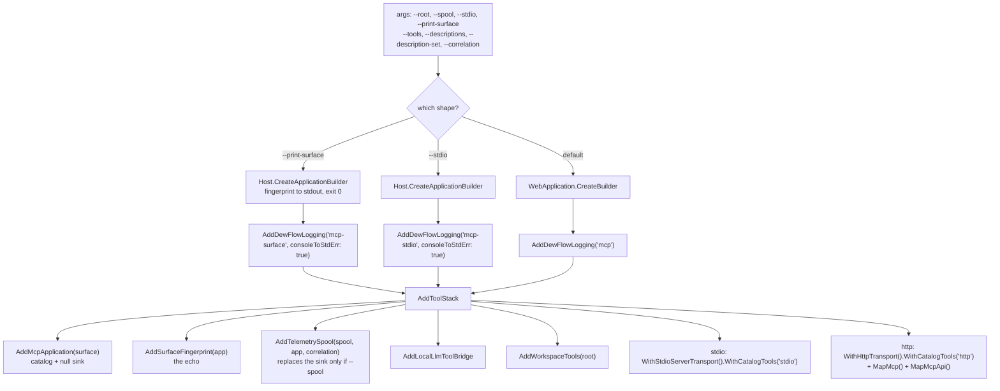

# Module — hosting

> `src/Mcp.Host`, `src/Mcp.Api`, `src/Mcp.Ui`, `src/ServiceDefaults`. The system as it is, 2026-08-16.

## Purpose

Compose the pieces into a process somebody can run: pick a transport, choose a workspace, decide whether
telemetry is on, and log in a way that survives being launched by an orchestrator.

The bar this host clears is deliberate — **clone this repository, run this, and a CLI has workspace tools
against a local checkout, with no product and no index anywhere.**

## Composition

## Entry points

| Surface | Route / switch |
|---|---|
| stdio transport | `--stdio` |
| HTTP transport | default; `app.MapMcp()` |
| Management API | `GET /api/mcp/health` → `{ "status": "ok" \| "degraded", "components": [ { "component", "healthy", "detail" } ] }` |
| Surface echo | `GET /api/mcp/surface` → the `SurfaceFingerprint`; or `--print-surface`, which writes the same JSON to stdout and exits 0 without binding a port |
| Workspace root | `--root <path>`, defaults to the current directory |
| Telemetry | `--spool <path>`; absent ⇒ nothing is written |
| Tool subset | `--tools a,b,c`; absent ⇒ every registered tool is advertised |
| Descriptions | `--descriptions <dir>` `--description-set <name>`; reads `<dir>/<set>/<tool>.md`, absent ⇒ the literals compiled into the providers stand |
| Correlation | `--correlation <leg[/phase]>`; stamps every telemetry record this process writes. **Refused on the HTTP transport** |

The three surface flags are parsed once by `ToolSurfaceOptions.From` and handed to `AddMcpApplication`;
a configuration that does not fit — a subset naming a tool nobody offers, a description file for a tool
this surface does not serve, a set named with no directory — stops the host during `StartAsync`, naming
both sides. On the stdio host that message goes to **stderr**, so stdout stays clean for the protocol.
Why any of this is configurable at all: [module_tool_dispatch.md](module_tool_dispatch.md) § *Rules
worth knowing*.

Two shapes of the host deliberately keep stdout for one thing only. `--stdio` gives it to the JSON-RPC;
`--print-surface` gives it to the fingerprint, so the output is what a CI assertion can pipe into `jq`.
Both send every log line to stderr. `--print-surface` opens no spool — a process that answers one
question and exits must not start a telemetry writer.

`--correlation` is refused rather than applied when the transport is the shared HTTP one: a
process-level stamp is truthful only where the process serves a single unit of work, and one value
across concurrent callers would invent an attribution. The refusal happens before anything is built.

## Logging

One `AddDewFlowLogging` for the repository, in `ServiceDefaults`, called **before** `Build()` — a host
that fails while wiring itself up is exactly when the log matters, and a logger installed afterwards has
nothing to say about it.

| Decision | Why |
|---|---|
| A hand-written `AnsiConsoleSink` instead of Serilog's console theme | Measured on Serilog.Sinks.Console 6.1.1: with `AnsiConsoleTheme.Code` **and** `applyThemeToRedirectedOutput: true`, redirected stdout received **zero** escape bytes. A control writing one escape by hand in the same process produced four. An orchestrator capturing a child's output redirects stdout by definition |
| `{Utc}` via `UtcTimestampEnricher`, not Serilog's `{Timestamp}` | The file is NAMED in UTC; `{Timestamp}` is a `DateTimeOffset` carrying the machine's local offset and renders local. That put `mcp-10-39-32.log` full of lines stamped `12:39:32` — two clocks in one artefact with nothing saying so |
| A file per RUN under a day folder | Rolling by day appends every run into one file, and the question actually asked is "what did THAT run do" |
| A stdio host logs to **stderr** | stdout carries the JSON-RPC. One log line there corrupts the stream and looks like a protocol bug rather than a logging one |
| Levels from `appsettings.json` | Verbosity is a config edit and a restart, never an edited call site. Defaults: `Information`, with `Microsoft.AspNetCore` and `System.Net.Http.HttpClient` at `Warning` |

`logs/` is git-ignored. The rule lives at `.claude/rules/shared/common/logging-serilog.md` — **one shared
copy, not a mirror**: since 2026-08-16 every `dew_flow_*` repository mounts `dew_flow_conventions` as a
submodule at `.claude/rules/shared/`, which is what ended the era of fixing the same timestamp bug in three
places.

## Health

`GET /api/mcp/health` is **computed**, from whatever registered itself as an `IHealthContributor`
(`Mcp.Contracts`). It used to return the constant `"ok"`, which answered for the ROUTE and said nothing
about the server behind it — an orchestrator polling it could not see a dead telemetry writer.

| Decision | Why |
|---|---|
| A port, not a reference to the telemetry sink | The API must be able to report a dead spool without learning what a spool is, and a component added later reaches the probe by registering itself — no edit inside `Mcp.Api` |
| Every contributor answers from live state, with no lock and no IO | A probe that blocks turns one slow component into an outage for every orchestrator polling it, which is the opposite of what it is for |
| A degraded server still answers **200** | The status code says the process is serving; the body says how well. A 503 for a broken spool would tell a supervisor to restart a server that is answering every tool call correctly |
| The components travel with the verdict | "degraded" without the numbers behind it moves the diagnosis somewhere else instead of answering it. An empty list says nothing was checked — it never reads as a check that passed |

Today the one contributor is `SpoolUsageSink` (registered only when `--spool` is given), reporting the
file it writes, whether the breaker tripped or the writer task faulted, and the drop count.

## Mcp.Ui

A Razor class library, WASM-compatible, referencing `Mcp.Contracts`. **It contains `_Imports.razor` and
nothing else** — no pages, no components. It exists so the eventual console is an RCL from birth rather
than a retrofit.

## Dependencies

- `Mcp.Host` → `Mcp.Server`, `Mcp.Api`, `Mcp.Bridge`, `Mcp.Telemetry`, `Workspace.Infrastructure`,
  `ServiceDefaults`, `ModelContextProtocol.AspNetCore`.
- `ServiceDefaults` → Serilog only. It configures sinks; libraries take `ILogger<T>` and say nothing
  about them.
- **The real product host is elsewhere.** `dew_flow_rag_qln` vendors this repository under
  `external/dew_flow_mcp/` and composes it with the **workspace tool set and a telemetry spool** in its own
  daemon — since 2026-08-16 it calls `AddTelemetrySpool(…, "daemon")` from the config key
  `Rag:Telemetry:SpoolDirectory` (`dew_flow_rag_qln · hosts/Daemon/Program.cs:120-121`), with the same opt-in
  semantics as `--spool` here: a blank directory registers nothing and the `NullUsageSink` stays, so a spool
  is something an operator turns on rather than something that appears on disk because a package was
  referenced. Retrieval tools are open work (`dew_flow_rag_qln · todo/PLAN_search_variant_axes.md` §3.6). That
  daemon serves exactly one MCP tool today, `rt_read_local_file`, which comes from here — there is no
  `IToolProvider` implementation in that repository yet. Said precisely because the looser sentence, "composes
  it with retrieval tools", was corrected on the *other* side of the boundary on 2026-08-15 and survived on
  this one: a claim about a neighbour repository is only as good as the last time somebody opened it.
  `Mcp.Host` is the minimal public standalone equivalent.

## What is missing

- **Authentication.** The HTTP transport is open. Fine on localhost; not fine the first time somebody
  binds it to a LAN, and somebody will.
- **Explicit Kestrel and request timeouts.** The web host relies on framework defaults, which the shared
  rule counts as an unnamed decision. Tracked as item 4 of
  [../todo/PLAN_reliability_tail.md](../todo/PLAN_reliability_tail.md), where it composes with the
  catalog's own 2-minute per-call ceiling.
- **Retention for `logs/` and the spool.** One file per run is correct, but the rotation that rule relies
  on IS the restart, and this deployment's premise is a process that does not restart (item 5 of the same
  plan).
- **A bound on a provider that ignores its token.** The catalog's ceiling cancels the token and answers
  the caller; a provider that never observes it keeps running behind the answer.
