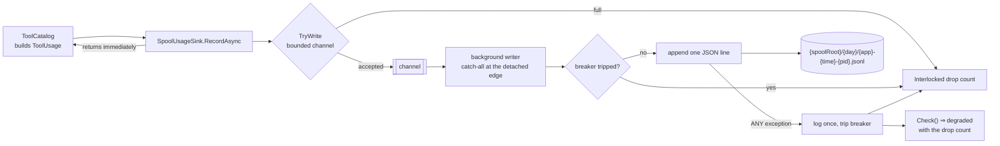

# Module — telemetry

> `src/Mcp.Telemetry`, and the `IUsageSink` half of `src/Mcp.Contracts`. The system as it is, 2026-08-16.

## Purpose

Record every tool call this server serves — benchmark traffic and real sessions alike — without ever
blocking, delaying or failing one.

This is the vantage point a harness does not have. A benchmark sees only its own legs; the server sees
**all** traffic, and knows things the harness can only infer: the payload actually returned, what the
call was scoped to, and how long the server itself took. Neither substitutes for the other.

Design record: [PLAN_usage_telemetry.md](PLAN_usage_telemetry.md). Wire contract:
[telemetry_v0_wire.md](telemetry_v0_wire.md).

## Flow



## Core types

| Type | Role |
|---|---|
| `IUsageSink` | The port. A port on purpose: this repository is public and must not carry a hardcoded telemetry destination |
| `NullUsageSink` | The default. Forgetting to register a sink loses telemetry rather than breaking tool calls |
| `SpoolOptions` | `Directory` (required), `App`, `Capacity` (default 4096) |
| `SpoolUsageSink` | The implementation. Exposes `Path` (the file this run writes), `Dropped` (records the spool refused), `Broken` (breaker tripped **or** the writer task faulted) and `Check()` — it is an `IHealthContributor` as well as an `IUsageSink` |
| `IHealthContributor` / `ComponentHealth` | The health port, in `Mcp.Contracts`. How a dead writer becomes visible from outside the process without `Mcp.Api` learning what a spool is |
| `TelemetryRecord` + `EmitterWire`, `CallerWire`, `CapturedTextWire`, `CapturedNumberWire` | The `telemetry/v0` line |
| `TelemetryJson` | The one serializer for the spool, so the emitted bytes have a single definition |

## Entry points

| Member | Purpose |
|---|---|
| `McpTelemetryExtensions.AddTelemetrySpool(services, spoolDirectory, app)` | Opt-in. A blank directory registers nothing and the null floor stays. When it does register, the SAME instance is added as an `IHealthContributor` |
| `TelemetryRecord.V0` | `"telemetry/v0"` — stamped on every line |
| `TelemetryRecord.From(usage, emitter)` | The domain record as the wire shape |

## The rules this module exists to keep

- **Never block a tool call.** `RecordAsync` hands the record to a bounded channel and returns a
  completed task. A background writer does the IO.
- **A full spool drops and COUNTS.** `BoundedChannelFullMode.Wait` paired with `TryWrite` — which does
  not wait, it refuses. The obvious `DropWrite` is a trap: it reports success while discarding the
  record, so the counter stays at zero. Measured at capacity 1: **500 records recorded, 2 written, 0
  counted.** That is the defect the counter exists to make impossible, and it was in the sink itself.
- **A broken disk trips a breaker.** One error log, recording stops for the run, later records count as
  dropped. A failing disk will not start working because we logged about it once per call.
- **The writer's catch is a catch-ALL, at the detached edge.** It used to name two IO types. The third —
  an `ArgumentException` from a malformed spool path — killed the drain loop for the life of the process
  with not one line in the log: the channel filled, every later record was refused, and the server looked
  healthy throughout. The task is awaited only in `DisposeAsync`, i.e. at a shutdown that may never come,
  so this catch is the last frame that can report anything at all. A list of anticipated types is a bet
  that the fourth type never comes.
- **The state is exposed, not just logged.** `Broken` also reports a faulted writer task, and `Check()`
  puts it on `/api/mcp/health` — a log line written at 03:00 is not a thing an orchestrator can poll.
- **One file per run**, under a day folder, UTC throughout — the same shape as the logging rule, for the
  same reason: the question asked of a spool is always "hand me what this host produced", and a file
  shared across runs cannot be handed over while it is being written.
- **Retention is decided at emit.** Payload budgets are applied by `ToolCatalog` before the record
  arrives, so no line ever exceeds them and there is no clean-up job to write later.

## Wire shape, in one line

```jsonc
{ "schema": "telemetry/v0", "at": "…Z", "emitter": {"app","pid","machine"},
  "caller": { "clientName": {"captured","value","reason"}, "clientVersion": {…},
              "model": {"captured": false, "reason": "the MCP protocol carries no model identity…"},
              "transport": "stdio" },
  "tool": "…", "scope": "…", "argumentsJson": "…", "argumentsTruncatedBytes": 0,
  "outcome": "answered|refused|error", "error": "",
  "responseChars": 42, "responseBody": "…", "responseTruncatedBytes": 0,
  "tokens": {"captured": false, "value": 0, "reason": "…"}, "serverMs": 13.4 }
```

`captured` ships even when true, so a consumer never infers "unknown" from an absent field. Outcome
names are written out rather than taken from `Enum.ToString()` — the three words are a published
vocabulary, and renaming the C# enum must not silently rename them.

## Dependencies

- **`Mcp.Contracts` only**, plus `Microsoft.Extensions.*` abstractions. An architecture test asserts it:
  a sink that knew its destination would put a product's database address in a public checkout.
- The consumer of the spool is `dew_flow_benchmark`, which owns the schema and drains files with
  `bench telemetry ingest`. Nothing here knows that.

## Tests

`tests/Mcp.Tests/SpoolUsageSinkTests.cs` — one line per record, the three outcome names, an uncaptured
field shipping its reason, the file's path shape, non-blocking recording with every record either
written or counted, an unwritable directory that never fails a call, and an **unexpected** writer fault
(a spool path the filesystem refuses with neither anticipated IO type) that is logged once and never
surfaces as a throw at shutdown. `HealthTests.cs` covers the probe side.

## What is not recorded

Tokens. No tool on this surface counts them, so the field is always *not captured* with that as the
reason — it exists so a surface that does count them (an embedder, a reranker) can fill it without a
schema change.
