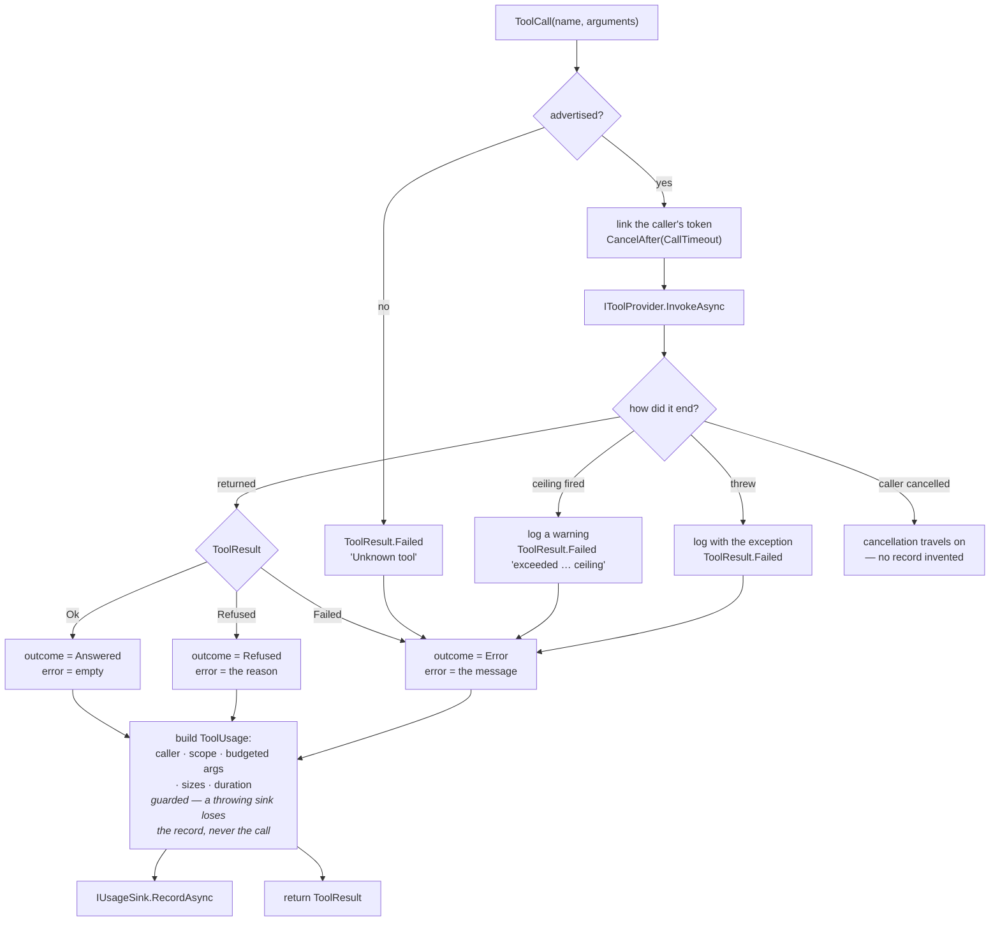

# Module — tool dispatch

> `src/Mcp.Contracts`, `src/Mcp.Application`. The system as it is, 2026-08-16.

## Purpose

Resolve a tool call to exactly one provider, run it, classify how it ended, and meter it — once, in one
place.

The problem it solves is structural rather than functional. This repository hosts tools it does not
implement and publishes them on more than one surface; without a single dispatch point each surface
grows its own copy of "find the tool, run it, count it", and the copies drift. The previous generation
of this system had exactly that, and the two surfaces scored **11/47 against 4/47 on identical tasks** —
a difference produced by the surfaces, not by the tools.

## Flow

Every branch is metered, including the unknown tool, the expired call and the thrown fault. A client
repeatedly asking for a tool this server does not advertise — a stale configuration, almost always — was
previously the one event nobody could see; a provider that THREW was the second, and worse, because the
one call worth investigating was the only one the ledger skipped.

The single exception is a call the CALLER cancelled: it travels on as cancellation rather than becoming a
fabricated failure, because the client is gone and a record of it would be a call nobody made.

## Core types

| Type | Shape | Notes |
|---|---|---|
| `IToolProvider` | `Tools`, `Scope`, `InvokeAsync` | The seam of the product. `Scope` is a default interface member, so a provider with no meaningful scope says nothing rather than inventing one |
| `ToolSchema` | `Name`, `Description`, `InputSchema`, `Trait` | The published contract. `ToolTrait` defaults to `ReadOnly` — a surface that guesses wrong in that direction is the dangerous one |
| `ToolCall` | `Name`, `Arguments` (`JsonElement`) | |
| `ToolResult` | closed union `Ok` / `Refused` / `Failed` | `Match` takes three arms; `Text` and (on providers' side) the refusal flag are the shared projections |
| `ToolCatalogOptions` | `CallTimeout` (default **2 minutes**) | What the catalog imposes on every call. Longer than the clients' own per-call timeouts, so the ceiling only ever reclaims calls whose caller has gone; `Timeout.InfiniteTimeSpan` disables it and hands the documented reason-plus-watchdog pair to the host. A non-positive value stops the host at construction |
| `ToolUsage` | tool, timestamp, caller, scope, budgeted arguments + truncation, outcome, error, response size + budgeted body + truncation, tokens, duration | The record `IUsageSink` receives |
| `ToolOutcome` | `Answered` / `Refused` / `Error` | Three states, because a guard that worked and a component that broke have different remedies |
| `CallerIdentity` | `ClientName`, `ClientVersion`, `Model` (each `Captured`), `Transport` | |
| `Captured` / `CapturedCount` | flag + value + reason | "Unknown" is a state with an explanation |

## Entry points

| Member | Purpose |
|---|---|
| `ToolCatalog.Advertised` | Every tool, name-ordered so the surface is stable across restarts |
| `ToolCatalog.InvokeAsync(ToolCall, ct)` | The dispatch point. Called by every presentation |
| `McpApplicationExtensions.AddMcpApplication()` | Registers the catalog, `AmbientCallerContext`, `TimeProvider.System`, `ToolCatalogOptions` and `NullUsageSink` as floors (`TryAdd`, so a host's real sink and its own ceiling survive) |
| `PayloadBudget.Apply(text, budgetBytes)` | Cuts a payload to a byte budget and reports the exact loss. Lives in `Mcp.Contracts` since 2026-08-16, not `Mcp.Application`: the sandboxed reader needs the same clipper for its byte cap and may not reference the catalog, so the shared half moved to their common ancestor rather than being written twice |

## Rules worth knowing before changing this

- **Duplicate names stop the host**, naming both providers. Silent shadowing is how a surface starts
  lying about what it runs.
- **Nothing thrown by a provider leaves this class.** `IToolProvider`'s contract permits a throw for a
  genuine infrastructure fault and the sandboxed reader takes it (a locked file, a delete between the
  exists-check and the read). It is logged with the exception first, metered as `Error`, and answered as
  `ToolResult.Failed`. A server that runs unattended must never lose a session to one tool.
- **Every call carries this server's own ceiling.** A linked `CancellationTokenSource` at the dispatch
  chokepoint means every present and future provider inherits it without knowing. It binds providers that
  honour their token — which the contract already requires; a provider that ignores it is not bounded by
  anything here.
- **Metering never fails a call.** `RecordAsync` is guarded end to end, budgeting included: a throwing
  sink loses the record, not the session the guard above just saved.
- **Budgets are bytes, not characters**, and the cut never splits a surrogate pair. `ToolCatalog`
  applies `DefaultPayloadBudgetBytes` (4096) to the arguments and to the response body; the response
  *size* is always exact even when the body was cut. This budget governs the TELEMETRY copy only —
  what a provider hands back to the caller is that provider's own ceiling to impose
  ([module_workspace_tools.md](module_workspace_tools.md) for the read caps).
- **Retention is decided at emit.** The spool never holds more than the budget, so there is no later
  clean-up job to forget.
- **The clock is injected** (`TimeProvider`), so a record's timestamp is testable.

## Dependencies

- `Mcp.Contracts` — the only project reference. `Mcp.Application` additionally uses
  `Microsoft.Extensions.DependencyInjection.Abstractions` and `Microsoft.Extensions.Logging.Abstractions`.
- Nothing here knows any provider by name; providers register themselves into the container.

## Tests

`tests/Mcp.Tests/ToolCatalogTests.cs`, `PayloadBudgetTests.cs`. They pin: every outcome reaches the sink
as its own state, an unknown tool is metered too, a provider that THROWS is answered as a failure and
still reaches the sink, a tool that never returns is cut off at the ceiling (and metered), a ceiling that
cannot be applied stops the host instead of throwing per call, a throwing sink loses the record and not
the call, tokens record as *not captured* rather than zero, an absent caller says why, the advertised
list is name-ordered, and the budget's boundary cases including the surrogate-pair cut.
