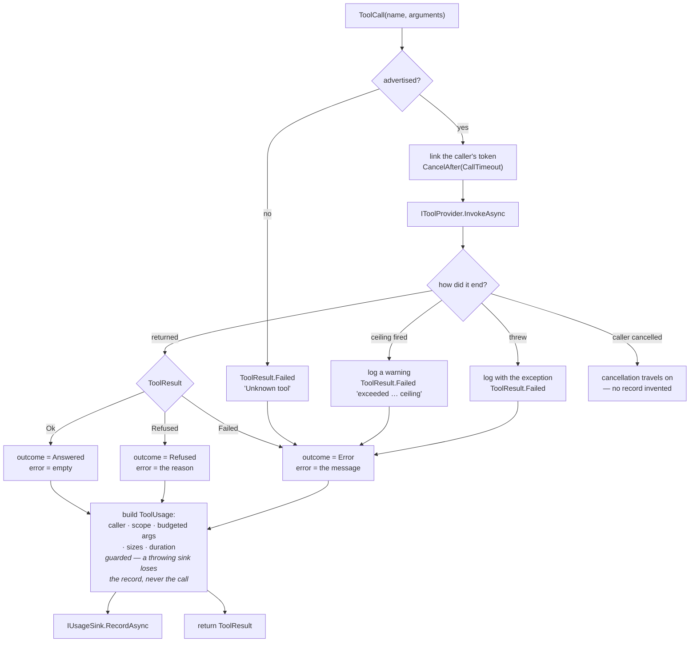

# Module — tool dispatch

> `src/Mcp.Contracts`, `src/Mcp.Application`. The system as it is, 2026-08-16.

## Purpose

Resolve a tool call to exactly one provider, run it, classify how it ended, and meter it — once, in one
place.

The problem it solves is structural rather than functional. This repository hosts tools it does not
implement and publishes them on more than one surface; without a single dispatch point each surface
grows its own copy of "find the tool, run it, count it", and the copies drift. The previous generation
of this system had exactly that, and the two surfaces scored **11/47 against 4/47 on identical tasks** —
a difference produced by the surfaces, not by the tools.

## Flow

Every branch is metered, including the unknown tool, the expired call and the thrown fault. A client
repeatedly asking for a tool this server does not advertise — a stale configuration, almost always — was
previously the one event nobody could see; a provider that THREW was the second, and worse, because the
one call worth investigating was the only one the ledger skipped.

The single exception is a call the CALLER cancelled: it travels on as cancellation rather than becoming a
fabricated failure, because the client is gone and a record of it would be a call nobody made.

## Core types

| Type | Shape | Notes |
|---|---|---|
| `IToolProvider` | `Tools`, `Scope`, `InvokeAsync` | The seam of the product. `Scope` is a default interface member, so a provider with no meaningful scope says nothing rather than inventing one |
| `ToolSchema` | `Name`, `Description`, `InputSchema`, `Trait` | The published contract. `ToolTrait` defaults to `ReadOnly` — a surface that guesses wrong in that direction is the dangerous one |
| `ToolCall` | `Name`, `Arguments` (`JsonElement`) | |
| `ToolResult` | closed union `Ok` / `Refused` / `Failed` | `Match` takes three arms; `Text` and (on providers' side) the refusal flag are the shared projections |
| `ToolCatalogOptions` | `CallTimeout` (default **2 minutes**) | What the catalog imposes on every call. Longer than the clients' own per-call timeouts, so the ceiling only ever reclaims calls whose caller has gone; `Timeout.InfiniteTimeSpan` disables it and hands the documented reason-plus-watchdog pair to the host. A non-positive value stops the host at construction |
| `ToolSurfaceOptions` | `Tools` (empty = every tool), `DescriptionsDirectory`, `DescriptionSet` | Which tools this process serves and where their wording comes from. All three default to "nothing configured", and `IsEverything` then takes the untouched registration path — the shipped default is the same code, not merely equivalent behaviour |
| `ToolDescriptionCatalog` | `Load(directory, set)`, `DescriptionFor(tool, builtIn)`, `NamedTools`, `Ignored` | Descriptions read once from `<directory>/<set>/<tool>.md`. The compiled literal is the FLOOR: a missing, blank or unreadable file yields it, and the reason is carried on `Ignored` rather than dropped |
| `ToolSurfaceProvider` | `internal`, decorates one `IToolProvider` | Filters to the subset and applies the description override with `with { Description = … }`. Sits AHEAD of the catalog — see the rule below |
| `SurfaceFingerprint` + `ToolDescriptionEcho` | in `Mcp.Contracts`: every tool name, the exact description text served, a per-tool schema hash, `ToolsHash`, `DescriptionsHash`, `App`, `Pid`, `Version` (a `Captured`), `TakenAt` | What this server is ACTUALLY advertising. Built from `Advertised`, never from the description files |
| `SurfaceFingerprintReader` + `SurfaceIdentity` | the service behind `--print-surface` and `GET /api/mcp/surface` | The app name is the host's to declare — only it knows which of its shapes is running |
| `ToolUsage` | tool, timestamp, caller, scope, budgeted arguments + truncation, outcome, error, response size + budgeted body + truncation, tokens, duration | The record `IUsageSink` receives |
| `ToolOutcome` | `Answered` / `Refused` / `Error` | Three states, because a guard that worked and a component that broke have different remedies |
| `CallerIdentity` | `ClientName`, `ClientVersion`, `Model` (each `Captured`), `Transport` | |
| `Captured` / `CapturedCount` | flag + value + reason | "Unknown" is a state with an explanation |

## Entry points

| Member | Purpose |
|---|---|
| `ToolCatalog.Advertised` | Every tool, name-ordered so the surface is stable across restarts |
| `ToolCatalog.InvokeAsync(ToolCall, ct)` | The dispatch point. Called by every presentation |
| `McpApplicationExtensions.AddMcpApplication()` | Registers the catalog, `AmbientCallerContext`, `TimeProvider.System`, `ToolCatalogOptions` and `NullUsageSink` as floors (`TryAdd`, so a host's real sink and its own ceiling survive) |
| `McpApplicationExtensions.AddMcpApplication(ToolSurfaceOptions)` | The same core over a configured surface: each registered provider is wrapped in a `ToolSurfaceProvider` before the catalog is built |
| `ToolSurfaceOptions.From(tools, directory, set)` | The three command-line strings a host reads, parsed once. The tool list is comma-separated |
| `McpApplicationExtensions.AddSurfaceFingerprint(app)` | Registers the echo. Called by the host, which supplies the app name |
| `SurfaceFingerprintReader.Read()` | The fingerprint of this process, now |
| `PayloadBudget.Apply(text, budgetBytes)` | Cuts a payload to a byte budget and reports the exact loss. Lives in `Mcp.Contracts` since 2026-08-16, not `Mcp.Application`: the sandboxed reader needs the same clipper for its byte cap and may not reference the catalog, so the shared half moved to their common ancestor rather than being written twice |

## Rules worth knowing before changing this

- **Duplicate names stop the host**, naming both providers. Silent shadowing is how a surface starts
  lying about what it runs.
- **Nothing thrown by a provider leaves this class.** `IToolProvider`'s contract permits a throw for a
  genuine infrastructure fault and the sandboxed reader takes it (a locked file, a delete between the
  exists-check and the read). It is logged with the exception first, metered as `Error`, and answered as
  `ToolResult.Failed`. A server that runs unattended must never lose a session to one tool.
- **Every call carries this server's own ceiling, and it binds providers that do not cooperate.** A linked
  `CancellationTokenSource` at the dispatch chokepoint means every present and future provider inherits it
  without knowing. The dispatch waits on the BUDGET rather than on the work (`work.WaitAsync(budget.Token)`),
  which is the part that had to be fixed: awaiting the provider directly made the ceiling a promise only a
  cooperative provider kept, since cancelling a token nothing reads changes nothing. The caller then got no
  answer at all rather than a late one — measured at a 200 ms ceiling still unanswered after five seconds.
  Since every provider is implemented in another repository, "reads its token" is not something this
  catalog may assume.
- **Work the ceiling could not stop is counted, not hidden.** Nothing in .NET stops a task that is not
  listening, so the abandonment is made visible instead: `ToolCatalog.Abandoned` counts it, a warning names
  the tool, and the task is OBSERVED — an abandoned task that later faults with nobody awaiting it would
  otherwise raise `UnobservedTaskException`, a process-level event attributed to nothing and arriving
  minutes later. Zero is the expected value; anything else names a provider that ignores its token.
- **A provider may throw synchronously, and that is normalised.** `IToolProvider` returns a `Task` and an
  implementation may throw before its first await — the sandboxed reader does, on a locked file. The
  invocation goes through a small `async` wrapper so every such throw arrives as a faulted task rather than
  on the dispatch stack, which is what keeps the guard above and the ceiling race compatible.
- **Metering never fails a call.** `RecordAsync` is guarded end to end, budgeting included: a throwing
  sink loses the record, not the session the guard above just saved.
- **Budgets are bytes, not characters**, and the cut never splits a surrogate pair. `ToolCatalog`
  applies `DefaultPayloadBudgetBytes` (4096) to the arguments and to the response body; the response
  *size* is always exact even when the body was cut. This budget governs the TELEMETRY copy only —
  what a provider hands back to the caller is that provider's own ceiling to impose
  ([module_workspace_tools.md](module_workspace_tools.md) for the read caps).
- **Retention is decided at emit.** The spool never holds more than the budget, so there is no later
  clean-up job to forget.
- **The clock is injected** (`TimeProvider`), so a record's timestamp is testable.
- **The surface is configured AHEAD of the catalog, never inside it.** `ToolSurfaceProvider` decorates
  each registered provider before `ToolCatalog` is constructed, so the catalog, `ToolSchema`,
  `IToolProvider`, `CatalogToolFunction` and `LocalLlmToolBridge` are untouched and parity between the
  two presentations holds *by construction*: both still project one `Advertised` list, which is simply
  now configurable. A description is a **measured artefact** — rewriting one routing instruction moved a
  score 16.5 points of 63 while quadrupling the toolbox moved it 1 — and one compiled into the binary
  cannot be A/B-ed without a rebuild.
- **A configuration that does not fit stops the host, naming both sides.** A subset naming a tool nobody
  offers is answered with what the providers OFFER; a description file for a tool the subset excluded is
  answered with what this surface SERVES. The two sets are deliberately different: telling an operator
  who typo'd `--tools` only the already-narrowed list hides exactly the tools they were choosing between
  (a real defect, caught by `ToolSurfaceTests` before it shipped).
- **A description is never empty, and never silently ignored.** A missing, blank or unreadable file
  falls back to the compiled literal, because a tool with no description is a tool no agent can route
  to. The fallback is logged with its reason at startup — an override somebody wrote and this server
  dropped is the same invisible failure the guards above exist to prevent.
- **Descriptions are read once, at startup.** A wording that changed mid-session would make one
  session's traffic two populations. Re-reading is a restart, which for a subprocess-per-task client is
  free.
- **The echo reports what is SERVED, not what was configured.** `SurfaceFingerprintReader` reads
  `catalog.Advertised`; asking the description files instead would report the request and call it the
  answer, which is exactly the confusion the echo exists to end. The hashes are computed here and
  quoted — a consumer stores and compares the string this server printed, never re-derives it, because
  a second canonicalisation is two implementations that must agree byte for byte forever.
- **The fingerprint carries no build timestamp, and that is a decision.** .NET's deterministic builds
  replace the PE link timestamp with a content hash, so a `BuiltAt` would be unobtainable or invented.
  What the assembly genuinely reports — its informational version, which here carries the commit SHA —
  travels as a `Captured`, and the two hashes are the build-independent identity of what is served.

## Dependencies

- `Mcp.Contracts` — the only project reference. `Mcp.Application` additionally uses
  `Microsoft.Extensions.DependencyInjection.Abstractions` and `Microsoft.Extensions.Logging.Abstractions`.
- Nothing here knows any provider by name; providers register themselves into the container.

## Tests

`tests/Mcp.Tests/ToolCatalogTests.cs`, `PayloadBudgetTests.cs`, `ToolDescriptionCatalogTests.cs`,
`ToolSurfaceTests.cs`, `SurfaceFingerprintTests.cs`, and the configured-surface case in
`SurfaceParityTests.cs`.

`SurfaceFingerprintTests` pins: the echo is the text the catalog advertises rather than the file it came
from; the hashes are stable across two builds of one configuration; a changed wording moves the
descriptions hash and leaves the tools hash and the schema hashes alone; a smaller subset moves the
tools hash; the process names itself; and the version is never a blank value claiming to be captured.

The surface tests pin: a named set overrides and a tool with no file keeps its literal; a blank file
falls back *and says so*; an unknown set is refused naming the sets that exist; a set does not see the
files of the directory around it; only the named tools are advertised; a call to a tool outside the
surface is **refused** and never reaches the provider; overriding a description carries the argument
schema through byte-identical; both mismatched-configuration cases stop the host naming both sides; a
set named with no directory stops the host; and — the guarantee the whole placement rests on — the
protocol surface and the bridge still advertise identical names, schemas and description text **under
configuration**.

`ToolCatalogTests`/`PayloadBudgetTests` pin: every outcome reaches the sink
as its own state, an unknown tool is metered too, a provider that THROWS is answered as a failure and
still reaches the sink, a tool that never returns is cut off at the ceiling (and metered), a ceiling that
cannot be applied stops the host instead of throwing per call, a throwing sink loses the record and not
the call, tokens record as *not captured* rather than zero, an absent caller says why, the advertised
list is name-ordered, and the budget's boundary cases including the surrogate-pair cut.
