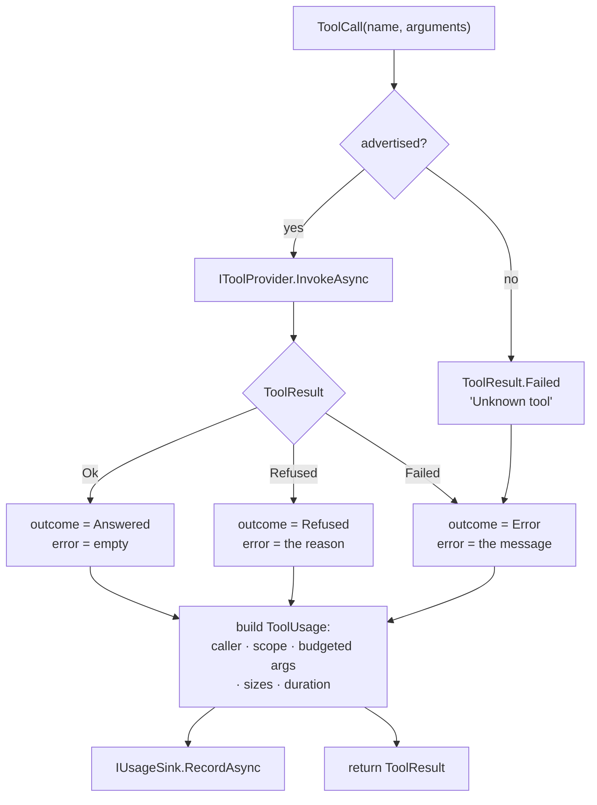

# Module — tool dispatch

> `src/Mcp.Contracts`, `src/Mcp.Application`. The system as it is, 2026-08-15.

## Purpose

Resolve a tool call to exactly one provider, run it, classify how it ended, and meter it — once, in one
place.

The problem it solves is structural rather than functional. This repository hosts tools it does not
implement and publishes them on more than one surface; without a single dispatch point each surface
grows its own copy of "find the tool, run it, count it", and the copies drift. The previous generation
of this system had exactly that, and the two surfaces scored **11/47 against 4/47 on identical tasks** —
a difference produced by the surfaces, not by the tools.

## Flow

Both branches are metered, including the unknown tool. A client repeatedly asking for a tool this server
does not advertise — a stale configuration, almost always — was previously the one event nobody could
see.

## Core types

| Type | Shape | Notes |
|---|---|---|
| `IToolProvider` | `Tools`, `Scope`, `InvokeAsync` | The seam of the product. `Scope` is a default interface member, so a provider with no meaningful scope says nothing rather than inventing one |
| `ToolSchema` | `Name`, `Description`, `InputSchema`, `Trait` | The published contract. `ToolTrait` defaults to `ReadOnly` — a surface that guesses wrong in that direction is the dangerous one |
| `ToolCall` | `Name`, `Arguments` (`JsonElement`) | |
| `ToolResult` | closed union `Ok` / `Refused` / `Failed` | `Match` takes three arms; `Text` and (on providers' side) the refusal flag are the shared projections |
| `ToolUsage` | tool, timestamp, caller, scope, budgeted arguments + truncation, outcome, error, response size + budgeted body + truncation, tokens, duration | The record `IUsageSink` receives |
| `ToolOutcome` | `Answered` / `Refused` / `Error` | Three states, because a guard that worked and a component that broke have different remedies |
| `CallerIdentity` | `ClientName`, `ClientVersion`, `Model` (each `Captured`), `Transport` | |
| `Captured` / `CapturedCount` | flag + value + reason | "Unknown" is a state with an explanation |

## Entry points

| Member | Purpose |
|---|---|
| `ToolCatalog.Advertised` | Every tool, name-ordered so the surface is stable across restarts |
| `ToolCatalog.InvokeAsync(ToolCall, ct)` | The dispatch point. Called by every presentation |
| `McpApplicationExtensions.AddMcpApplication()` | Registers the catalog, `AmbientCallerContext`, `TimeProvider.System`, and `NullUsageSink` as a floor (`TryAdd`, so a host's real sink survives) |
| `PayloadBudget.Apply(text, budgetBytes)` | Cuts a payload to a byte budget and reports the exact loss |

## Rules worth knowing before changing this

- **Duplicate names stop the host**, naming both providers. Silent shadowing is how a surface starts
  lying about what it runs.
- **Budgets are bytes, not characters**, and the cut never splits a surrogate pair. `ToolCatalog`
  applies `DefaultPayloadBudgetBytes` (4096) to the arguments and to the response body; the response
  *size* is always exact even when the body was cut.
- **Retention is decided at emit.** The spool never holds more than the budget, so there is no later
  clean-up job to forget.
- **The clock is injected** (`TimeProvider`), so a record's timestamp is testable.

## Dependencies

- `Mcp.Contracts` — the only project reference. `Mcp.Application` additionally uses
  `Microsoft.Extensions.DependencyInjection.Abstractions` and `Microsoft.Extensions.Logging.Abstractions`.
- Nothing here knows any provider by name; providers register themselves into the container.

## Tests

`tests/Mcp.Tests/ToolCatalogTests.cs`, `PayloadBudgetTests.cs`. They pin: every outcome reaches the sink
as its own state, an unknown tool is metered too, tokens record as *not captured* rather than zero, an
absent caller says why, the advertised list is name-ordered, and the budget's boundary cases including
the surrogate-pair cut.
