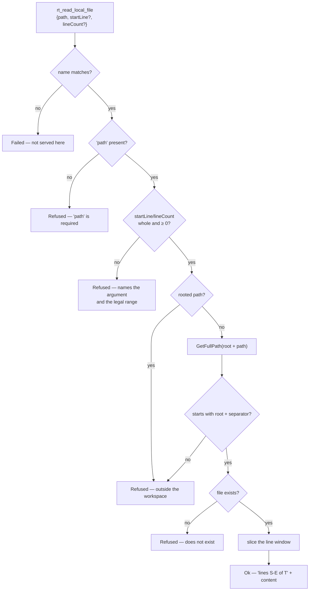

# Module — workspace tools

> `src/Workspace.Application`, `src/Workspace.Infrastructure`. The system as it is, 2026-08-15.

## Purpose

Give a caller one real capability — reading a file from a bounded workspace — and prove that
`IToolProvider` carries a real tool rather than being an interface nobody implements.

**One tool, deliberately.** The tool set was always going to change completely, so this exists to
exercise the MECHANISM end to end (schema, dispatch, sandbox refusal, both presentations, telemetry),
not to be the final catalog. The three planned families (`rt_`, `rag_`, `graf_`) are open work in
[../todo/PLAN_mcp_product.md](../todo/PLAN_mcp_product.md).

## Flow

## Core types

| Type | Shape |
|---|---|
| `ISandboxedFileReader` | `Sandbox` (which workspace), `ReadAsync(FileReadRequest, ct)` |
| `FileReadRequest` | `Path`, `StartLine = 0` (0 ⇒ from the top), `LineCount = 0` (0 ⇒ to the end) |
| `FileReadOutcome` | closed union: `Ok(Content, StartLine, EndLine, TotalLines)` \| `Refused(Reason)` |
| `WorkspaceRoot` | The one directory the tools may touch, resolved and trailing-separator-trimmed |
| `WorkspaceToolProvider` | `IToolProvider`; `Scope => reader.Sandbox` |
| `SandboxedFileReader` | The adapter; holds the root and the logger |

## Entry points

| Member | Purpose |
|---|---|
| `WorkspaceToolProvider.ReadLocalFile` | `"rt_read_local_file"` — the advertised name |
| `WorkspaceExtensions.AddWorkspaceTools(services, rootPath)` | Registers the root, the reader and **itself as an `IToolProvider`** — the whole inversion in one line: the MCP module never names this provider |

## Behaviours that are guarantees, not conveniences

- **Resolve, then compare.** The guard resolves the full path and compares it against the resolved root.
  Checking the *string* for `..` does not work: `a/../../b` and a symlink both spell fine.
- **A denial is a `Refused`, not a `Failed`.** The guard working is the opposite event from the disk
  breaking, and a ledger that files both under one flag can count neither.
- **A read returns a line WINDOW**, and every result reports `startLine`/`endLine`/`totalLines`, so
  paging is a number rather than a guess. A tool that only returns whole files makes an agent pull
  megabytes to see forty lines — and it will, every time.
- **A start past the end is not an error.** It returns empty content with the real total, so the caller
  corrects the offset by number.
- **Client numbers are range-checked before any arithmetic, and the window is computed in `long`.** The
  window used to be `start + count - 1` in `int`: with `{"startLine":2,"lineCount":2147483647}` — one
  call, any client — it wrapped negative, `Math.Min` picked the negative, and the range indexer threw an
  unhandled `ArgumentOutOfRangeException` out of a chain with no `catch` in it. A NEGATIVE is now refused
  naming the argument and the legal range; a count larger than the file is CLAMPED, because "everything
  from line 2" is what a pager sends and refusing it would be wrong.
- **A number the boundary cannot hold is refused, never defaulted.** `{"startLine": 999999999999}` read
  as 0 would answer with the top of the file — a wrong window that looks like a success, which is the one
  failure a caller cannot detect.
- **Scope is reported.** `Scope` answers "a file was read, but *where*" — the other half of the fact,
  and what telemetry records per call.

## Dependencies

- `Workspace.Application` → `Mcp.Contracts` only.
- `Workspace.Infrastructure` → `Workspace.Application`, `Mcp.Contracts`,
  `Microsoft.Extensions.Logging.Abstractions`, `Microsoft.Extensions.DependencyInjection.Abstractions`.
- No file is ever written. The surface reads; the write path lives in the private product, and that
  boundary is what lets this repository be public at all.

## Known gap

`File.ReadAllLinesAsync` reads the whole file into memory whatever its size, and `PayloadBudget` bounds
only the TELEMETRY copy — nothing bounds what goes back over the wire. Capping it is a contract decision
(a truncated read must say so and name the real total, or the caller pages blindly), so it is tracked as
item 1 of [../todo/PLAN_reliability_tail.md](../todo/PLAN_reliability_tail.md) rather than patched.

## Tests

`tests/Mcp.Tests/WorkspaceToolTests.cs` — the line window by number, a start past the end, a
`lineCount` of `int.MaxValue` that reads to the end instead of overflowing into a crash, a negative
count refused with the legal range, a `startLine` too large for an `int32` refused rather than read from
the top, two shapes of escape (`../` and `sub/../../`), an absolute path, a missing argument, and that
the provider reports its workspace.
