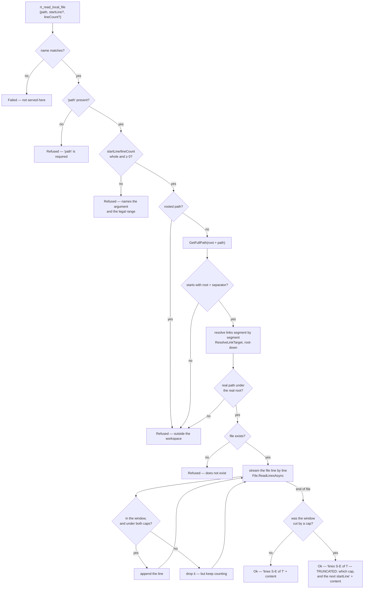

# Module — workspace tools

> `src/Workspace.Application`, `src/Workspace.Infrastructure`. The system as it is, 2026-08-16.

## Purpose

Give a caller one real capability — reading a file from a bounded workspace — and prove that
`IToolProvider` carries a real tool rather than being an interface nobody implements.

**One tool, deliberately.** The tool set was always going to change completely, so this exists to
exercise the MECHANISM end to end (schema, dispatch, sandbox refusal, both presentations, telemetry),
not to be the final catalog. The three planned families (`rt_`, `rag_`, `graf_`) are open work in
[../todo/PLAN_mcp_product.md](../todo/PLAN_mcp_product.md).

## Flow

## Core types

| Type | Shape |
|---|---|
| `ISandboxedFileReader` | `Sandbox` (which workspace), `ReadAsync(FileReadRequest, ct)` |
| `FileReadRequest` | `Path`, `StartLine = 0` (0 ⇒ from the top), `LineCount = 0` (0 ⇒ to the end) |
| `FileReadOutcome` | closed union: `Ok(Content, StartLine, EndLine, TotalLines, Truncation)` \| `Refused(Reason)` |
| `ReadTruncation` | `Clipped` + `Reason` — the family's flag-and-reason shape. `None` is the ordinary case |
| `WorkspaceRoot` | The one directory the tools may touch, resolved and trailing-separator-trimmed |
| `SandboxedFileReaderOptions` | `MaxLines` (default **5 000**), `MaxBytes` (default **1 MiB**) — what ONE read may materialize and hand back |
| `WorkspaceToolProvider` | `IToolProvider`; `Scope => reader.Sandbox` |
| `SandboxedFileReader` | The adapter; holds the root, the caps and the logger |

## Entry points

| Member | Purpose |
|---|---|
| `WorkspaceToolProvider.ReadLocalFile` | `"rt_read_local_file"` — the advertised name |
| `WorkspaceExtensions.AddWorkspaceTools(services, rootPath)` | Registers the root, the caps (`TryAdd`, so a host may raise them), the reader and **itself as an `IToolProvider`** — the whole inversion in one line: the MCP module never names this provider |

## Behaviours that are guarantees, not conveniences

- **Resolve, then compare — twice.** The lexical pass (`GetFullPath` + prefix compare) stops `..`
  traversal, which a string scan does not: `a/../../b` spells fine. It cannot see NTFS links, because
  `GetFullPath` never touches the disk — so until 2026-08-19 a junction inside the root pointing outside
  it read straight through, while SECURITY.md claimed otherwise. The REAL-PATH pass closes that: every
  existing segment resolved through `ResolveLinkTarget` (root-down, so a junction mid-chain is seen, not
  only at the leaf), compared against the equally-resolved root. Links that stay inside the root still
  read — the refusal is about where the target lives, not about links as such.
- **A denial is a `Refused`, not a `Failed`.** The guard working is the opposite event from the disk
  breaking, and a ledger that files both under one flag can count neither.
- **A read returns a line WINDOW**, and every result reports `startLine`/`endLine`/`totalLines`, so
  paging is a number rather than a guess. A tool that only returns whole files makes an agent pull
  megabytes to see forty lines — and it will, every time.
- **A start past the end is not an error.** It returns empty content with the real total, so the caller
  corrects the offset by number.
- **Client numbers are range-checked before any arithmetic, and the window is computed in `long`.** The
  window used to be `start + count - 1` in `int`: with `{"startLine":2,"lineCount":2147483647}` — one
  call, any client — it wrapped negative, `Math.Min` picked the negative, and the range indexer threw an
  unhandled `ArgumentOutOfRangeException` out of a chain with no `catch` in it. A NEGATIVE is now refused
  naming the argument and the legal range; a count larger than the file is CLAMPED, because "everything
  from line 2" is what a pager sends and refusing it would be wrong.
- **A number the boundary cannot hold is refused, never defaulted.** `{"startLine": 999999999999}` read
  as 0 would answer with the top of the file — a wrong window that looks like a success, which is the one
  failure a caller cannot detect.
- **The read STREAMS; memory scales with the WINDOW, not the file.** It was `File.ReadAllLinesAsync` —
  the whole file into a `string[]` whatever its size — with the window sliced afterwards, so one large
  file in the workspace was a multi-hundred-megabyte allocation on a process that never restarts. It is
  `File.ReadLinesAsync` now, and the enumeration deliberately runs *to the end of the file* after the
  window is full: the caller pages by the real total, and the end of the file is the only place that can
  be counted. That pass costs I/O and no memory, it is no more I/O than the old read already did, and
  `ToolCatalogOptions.CallTimeout` is what bounds how long it may take.
- **Two caps, because either alone bounds nothing.** A LINE cap does not stop a minified bundle, a
  one-line JSON document or a base64 blob — each is ONE line of however many megabytes. A BYTE cap alone
  would let five thousand short lines out as one content block nobody asked for. Both are
  `SandboxedFileReaderOptions`, `TryAdd`-registered so a host with legitimately huge files raises them
  deliberately, and a cap that could never return anything stops the host **at construction** rather than
  producing an empty answer on every read for the life of a process nobody is watching.
- **A truncation the caller cannot SEE is worse than no cap at all.** A short answer would otherwise read
  as a short file and paging would stop there. So a capped answer says `TRUNCATED`, names *which* cap,
  carries the file's **true** `totalLines`, and gives the next `startLine` as a number:
  `lines 1-5000 of 6000 — TRUNCATED: the window stops at this server's 5000-line read cap. Ask again with
  startLine 5001 to continue.` The advice is generated by the reader, not the provider, because only the
  reader knows the one case where paging cannot help — a single line longer than the byte cap, whose
  remainder no `startLine` can reach. That case says so instead.
- **The byte cap stops on a whole line.** A cut mid-line would hand back a `startLine` that skips the
  remainder of the line it cut. The exception is the very first line of a window: it is taken whatever its
  size and clipped by the shared `PayloadBudget` (which is why that clipper moved to `Mcp.Contracts`),
  because a window that comes back empty cannot be paged past at all.
- **A capped read is logged.** At `Information`, with the path, the span and the reason — repeated cuts
  are how an operator learns the workspace holds something nobody should read whole, or that the cap is
  wrong for this host.
- **Scope is reported.** `Scope` answers "a file was read, but *where*" — the other half of the fact,
  and what telemetry records per call.

## Dependencies

- `Workspace.Application` → `Mcp.Contracts` only.
- `Workspace.Infrastructure` → `Workspace.Application`, `Mcp.Contracts` (transitively — `PayloadBudget`
  and `IToolProvider`), `Microsoft.Extensions.Logging.Abstractions`,
  `Microsoft.Extensions.DependencyInjection.Abstractions`.
- No file is ever written. The surface reads; the write path lives in the private product, and that
  boundary is what lets this repository be public at all.

## Known gap

The caps bound the window, but one LINE is still materialized whole before it can be measured — that is
inherent to any line-oriented read, and it is the floor this design accepts. Peak transient memory is
therefore the longest line in the file rather than the file; what changed is that it is no longer the
whole file, held for the duration.

## Tests

`tests/Mcp.Tests/WorkspaceToolTests.cs` — the line window by number, a start past the end, a
`lineCount` of `int.MaxValue` that reads to the end instead of overflowing into a crash, a negative
count refused with the legal range, a `startLine` too large for an `int32` refused rather than read from
the top, two shapes of escape (`../` and `sub/../../`), an absolute path, a missing argument, that
the provider reports its workspace, and the caps: a file past the line cap reported as `TRUNCATED` with
the real total, a single line past the byte cap clipped with the "paging cannot reach this" wording, a
multi-line window stopping on a whole line at the byte cap, a host-lowered cap whose recommended next
`startLine` actually works, a window the caller ASKED for never marked truncated, and a cap that could
never return anything stopping the host at construction.

**What the suite does not prove:** that the read streams rather than materializes. Every *observable*
consequence is pinned above, but the difference between the two implementations is peak LIVE memory
during an async read — only assertable by sampling, which is flaky, or through a line-source seam that
would exist purely to be observed. Recorded here rather than covered by a test that would pass either
way. The change itself is one call: `File.ReadLinesAsync` in `SandboxedFileReader.WindowAsync`, and no
`string[]` of the file anywhere in the class.
